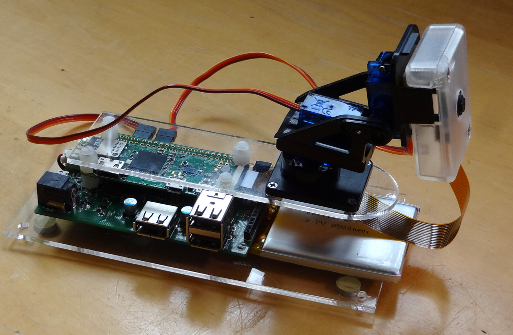
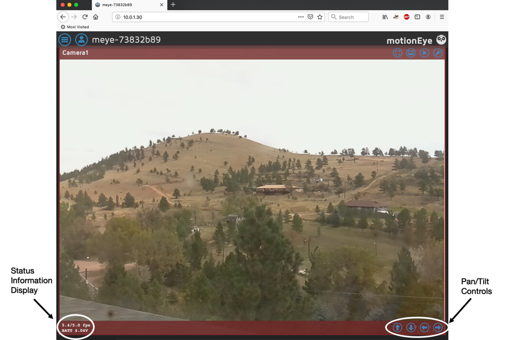
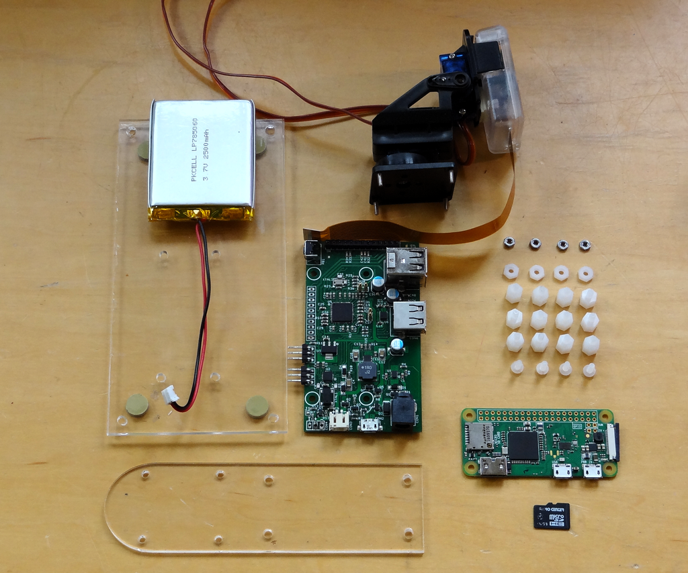
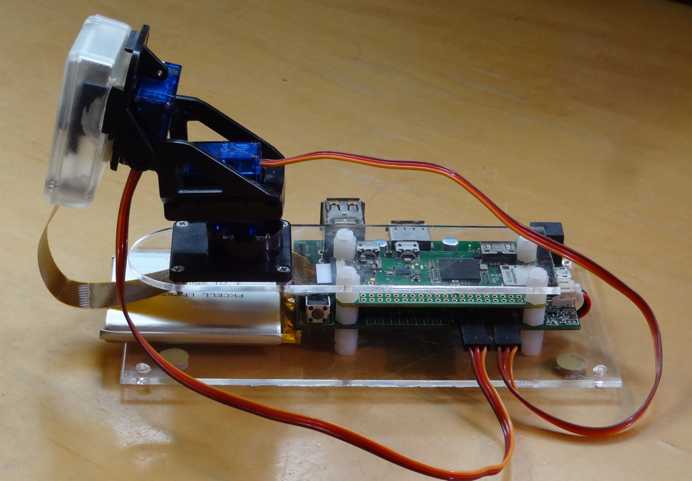
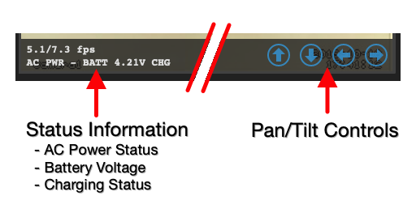

# motioneyeos with battery backup, pan/tilt servos and status display
Calin Crisan's excellent [motioneyeos](https://github.com/ccrisan/motioneyeos) is a complete Linux distribution that turns the Raspberry Pi Zero into a highly functional wireless webcam.  He provides detailed instructions for installation and configuration; some are referenced here.  These instructions show how to use the Pi Platter to extend the capability of motioneyeos with battery backup, pan/tilt servos and a status information display.



Installation is simple using the extension capabilities built-in to the motioneyeos distribution.  The Pan/Tilt controls as well as a status display showing battery and charging conditions show up in the web interface.



Building this web cam consists of the following steps described in this readme.

1. Acquire necessary hardware
2. Assemble camera
3. Load the motioneyeos distribution onto the MicroSD card
4. Configure motioneyeos for your wifi and start it running
5. Add files from this repository to enable the new functions
6. Enjoy your new webcam

I encourage you to read the Pi Platter Manual found in the [documentation](https://github.com/danjulio/rocketblue-automation/tree/master/pi_platter/documentation) directory as well as the thorough documenation in the [motioneyeos wiki](https://github.com/ccrisan/motioneyeos/wiki).

## Hardware components
I built my unit using components that I had on hand.  You can certainly substitute some components like the backup battery and pan/tilt assembly.



1. Raspberry Pi Zero W with Pi Camera and cable.  Available from [Adafruit](https://www.adafruit.com/product/3400) as well as other distributors.
2. Pan/Tilt assembly with 5-6V servos.  There are a lot of these available.  I used the pan/tilt assembly from a [Pimoroni device](https://shop.pimoroni.com/products/pan-tilt-hat).  The main thing to note is that you should use smaller (lower-current) servos.  These operate better on 5V.  I enclosed my camera in a small plastic box but most pan/tilt assemblies have a way to directly attach the camera.
3. 8 GB or larger Micro-SD card.  Available everywhere but I often buy industrial rated cards like the [Sandisk SDSDQAF3-008G-XI](https://www.mouser.com/ProductDetail/SanDisk/SDSDQAF3-008G-XI?qs=sGAEpiMZZMve4%2FbfQkoj%252BPBc86dadE%252BbhWQc16NFEHg%3D).
4. [Solar Pi Platter](https://www.tindie.com/products/globoy/solar-pi-platter/) available on tindie.
5. 2000-6000 mA 3.7 volt LiPo battery.  I used a [2000 mA battery from Sparkfun](https://www.sparkfun.com/products/13855) that should provide at least 2 hours of run-time.
6. [5.1 - 5.25 volt 2A USB Power supply](https://www.amazon.com/Argon-Raspberry-Listed-Power-Supply/dp/B07MC7B9X3/ref=sr_1_2?keywords=5.1V+USB+power+supply&qid=1571424925&s=electronics&sr=1-2) with USB Micro-B connector.  The wiring in many USB adaptors is pretty thin which leads to a voltage drop at the input of the Pi Platter that may cause it to reduce charging current unnecessarily.
7. Fastening hardware.  I used the same nylon 4-40 0.25 inch tall nylon stand-offs and nuts/screws as are used to fasten the Pi Zero to the Pi Platter.  Search for the following part numbers on Mouser: 561-MF440-25, 561-G440, and 561-P440.25.
8. Two 3-pin right-angle 0.1 inch headers for the servo connections.  Alternatively you can solder the servo wires directly to the Pi Platter PWM outputs.
9. Enclosure.  I laser-cut a two piece assembly for this example but you may want a different type of enclosure depending on your application.  The files for my cut-outs may be found in the ```plastic_cutouts``` directory in this repository.

## Hardware assembly
Assembly is straight-forward.  The Pi Zero mounts on top of the Pi Platter using the included mounting hardware.  This assembly mounts in the enclosure in a stacked arrangment.



I held the battery down with a piece of double-sided sticky tape.

Connections to the Pi Platter are made as shown in the following image. Check the servo connections to make sure they match.  Most servos I've seen use a Brown-Red-Orange cable for GND-5V-PWM.  


## motioneyeos installation
It may be helpful to attach a monitor and USB keyboard during installation.

### Install motioneyeos
1. Download motioneyeos for Raspberry PI (A, B, A+, B+, Compute Module, Zero and Zero W models) from the [github repository](https://github.com/ccrisan/motioneyeos/wiki/Supported-Devices).  I used version 20190427 and have kept a copy.  Contact me in case you run into a problem with the current version and I can arrange to transfer that to you.
2. Extract the image from the archive and [write the OS Image](https://github.com/ccrisan/motioneyeos/wiki/Installation) to your Micro-SD Card as described in the wiki.  
3. [Configure](https://github.com/ccrisan/motioneyeos/wiki/Wifi-Preconfiguration) the system to access your wifi as described in the wiki before attempting to boot.  You can also do this from the keyboard/monitor after booting if necessary.
4. [Configure](https://github.com/ccrisan/thingos/wiki/static_ip.conf) the system with a static IP address if you like.  Otherwise you'll have to use the keyboard/monitor or an external utility like Fing to determine the DHCP served IP address your Pi receives.


### Boot motioneyeos
Unmount the Micro-SD Card and put in the Raspberry Pi.  Connect the Pi Platter to the battery and USB Power supply.  Then power up the system by pressing the power button on the Pi Platter for two seconds until you see the green power LED light.  The initial boot may take a couple of minutes as motioneyeos configures itself.  You can see the progress if you have a monitor attached to the Pi.  After the system boots and motioneye starts you should be able to view your webcam by pointing your browser at the Pi's IP address.


## Pi Platter software installation
The motioneyeos distribution creates a partion, ```/data```, that is used to store persistent changes.  It is created during the first boot.  We manually put the additional files in this partition (```/data/etc```).

1. The pre-built ```talkpp``` binary found elsewhere in this [repository](https://github.com/danjulio/rocketblue-automation/tree/master/pi_platter/unix_applets/talkpp) is used by the scripts to communicate with the Pi Platter.
2. The five scripts found in the ```scripts``` directory here use the motioneyeos [Action Button](https://github.com/ccrisan/motioneyeos/wiki/Action-Buttons) capabilty to allow control of the servos and for displaying information from the Pi Platter in the web interface.

### Install files
The ```talkpp``` binary and five script files are easily copied to the  ```/data/etc``` directory using ```scp``` or via a USB Memory Stick.

#### Using scp

Download the files to your local computer and execute the following commands from the directory containing the files.  Put your Pi's IP address in the ```[IP Address]``` field.

```
	scp talkpp admin@[IP ADDRESS]:/data/etc
	scp *_1 admin@[IP ADDRESS]:/data/etc
```

Note that by default motioneyeos has no password.  You can and should add a password using the web interface.

#### Using a USB memory stick
1. Copy the files to a FAT-formatted USB memory stick on your computer.
2. Eject the memory stick and then plug it into one of the Pi Platter USB ports.  Motioneyeos will mount it in the ```/data/media``` directory.
3. Log in to the Pi via ssh or using the keyboard/monitor and copy the files from the memory stick to the system.

```
	cp /data/media/sda1/talkpp /data/etc
	cp /data/media/sda1/*_1 /data/etc
```

### Ensure file permissions
Make sure that the files have the correct linux file permissions so that motioneyeos can execute them.  From a motioneyeos shell prompt, type the following.

```
	chmod 700 /data/etc/talkpp
	chmod 700 /data/etc/*_1
```

### Edit /data/etc/userinit.sh
The ```/data/etc/userinit.sh``` file allows motioneyeos to execute custom commands when it boots.  We use this facility to configure the Pi Platter to automatically restart the system in the case that AC power has failed and the system runs from battery until it is discharged and the Pi Platter shuts down power.

From a motioneyeos shell prompt, edit the ```/data/etc/userinit.sh``` file using an editor such as ```vi``` or ```nano```.  Add the following to the end of the file and save it.

```
	# Configure the Pi Platter to auto-restart on battery re-charge after shutdown
	/data/etc/talkpp -c C7=1 
```

## Restart and verify operation

Type ```reboot``` from a shell prompt or user the web interface to restart the system.  After it reboots you should be able to control the servos and view Pi Platter status via the motioneyeos web interface.  Clicking on the video image streaming from the camera should cause motioneyeos to add an overlay to the image with status information from the Pi Platter on the lower left and four pan/tilt buttons on the lower right.




## Notes

### Servo range
The pan/tilt scripts have constants that set the minimum and maximum PWM values to send to the servos.  These were values I found worked for my system.  However you may end up needing to modify them if you find your servos hit the end of their motion range (they will make a grinding sound and take a lot of current as the motor tries to push the servo past its limit).  This can harm the servos as well as possibly draw so much current that the Pi Platter will shut down.

For example, the ```left_1``` script controls panning left.  It does this by increasing the PWM value written to the Pi Platter to control the pan servo on PWM 1.  The PWM values range from 0-255 but this script limits the maximum PWM value using the constant ```PWM_MAX``` (to 250 in my version).  You should decrease this value if you find the servo hitting the end of its range when panning left.  To change the maximum to 240, edit the ```left_1``` script and change the constant.

```
	# Maximum PWM value
	PWM_MAX=240
```

Likewise you would decrease the ```PWM_MAX``` constant in ```down_1``` and increase the ```PWM_MIN``` constant in ```right_1``` and ```up_1``` to further limit servo travel.

### Power notes
My system requires an average 430-450 mA from the USB power supply when running but not charging the battery.  It takes more current as the servos move and up to an additional 750 mA when charging the battery.  The USB Power adapter should be able to provide at least 2A of current.

The Pi Platter powers the system from the USB Power adapter when power is available on that input.  It uses a voltage threshold of appoximately 4.7 volts to switch from USB power to the battery.  It also reduces the charge current to the battery as the USB input voltage drops.  Since many USB adapter cables use thin wires and the current draw by the system may exceed 1 A, the voltage seen by the Pi Platter may be significantly lower than the output of the USB adapter.  For this reason I recommend using an adapter that outputs 5.1 to 5.25 volts.

If you see ```AC PWR``` status display blinking on and off then it is likely that the USB voltage seen by the Pi Platter is too low and it is constantly switching between USB and battery power.

The system will draw over 700 mA from the battery when operating from it.  Battery capacities of 2000-6000 mA are a good match for this system depending on the amount of time it should be able to run on battery power alone.

### Shutting down power
The Pi Platter command ```C7=1``` executed in the modified ```userinit.sh``` file configures it to automatically restore power after a shutdown due to a low battery.  For this reason the system will also immediately power back on and reboot if you shut down power to the system by holding the Pi Platter power button for several seconds (because the battery voltage is above the restart threshold).  To shut down power, first log into the system and execute the following command to disable the auto-restart function before powering down the system using the Pi Platter power button.

```
	/data/etc/talkpp -c C7=0
```

## Optional Features

### Enable the Pi to act as a WiFi Access Point
The motioneyeos software may be configured to create its own network, acting as a WiFi access point.  This is useful for a remote time-lapse or security system located in an area without WiFi.  Configuring the system as a WiFi access point must be done after the initial installation/boot.  Detailed instructions can be found at [WiFi-Access-Point](https://github.com/ccrisan/motioneyeos/wiki/WiFi-Access-Point).

For some reason I don't understand enabling this mode disables ssh access so it's important to have finished the additional installation before performing these steps.

### Pi Platter RTC
The Pi Platter contains a battery-backed real-time clock that can be used to set the Pi's system clock for the cases that it is unable to access a network time server.

To set the Pi Platter RTC from the Pi's system clock (assuming it has the correct time and date):

```
	/data/etc/talkpp -s
```

To set the Pi's system clock from the Pi Platter RTC:

```
	date $(/data/etc/talkpp -t)
```

This command may be included in the ```userinit.sh``` file.

### Temperature Measurement using Pi Platter analog input
The Pi Platter includes two analog inputs with configurable ADC voltage references.  These could be used to for additional status information like temperature using an analog temperature sensor.

For example, the TMP36 chip can operate from 5V and outputs a voltage directly proportional to the temperature over the range −40°C to +125°C.  It has a 500 mV (0.5V) offset at 0°C and a 10mV per °C change (the device will read 750 mV at 25°C).  Configuring the Pi Platter ADC reference to 1.024 volts allows 10-bit ADC measurements from −40°C to +52.4°C.

Information about using the ADC inputs can be found in the Pi Platter user manual.  The ```monitor_1``` may be modified to read and display the temperature from the analog input(s).